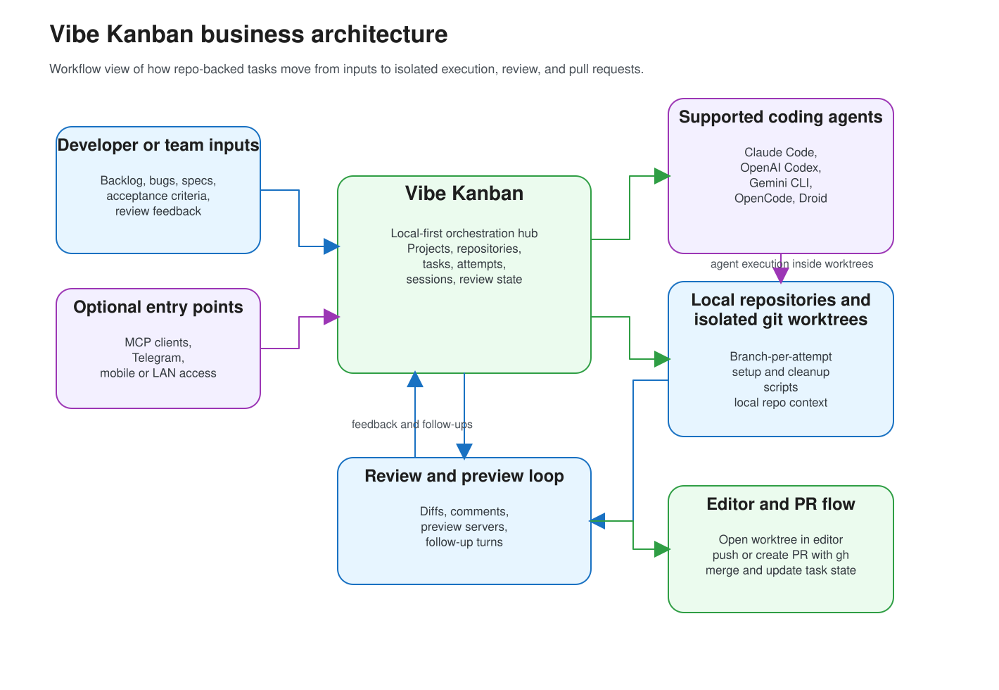

# Vibe Kanban

Vibe Kanban is a local-first orchestration layer for turning repo-backed tasks into isolated agent workspaces, reviewed diffs, and pull requests.

> Safety: coding agents may run with high-autonomy profiles. Every task attempt executes in isolated git worktrees, but you should still review changes, protect secrets, and keep backups.
>
> Upstream status: this repository follows and extends [BloopAI/vibe-kanban](https://github.com/BloopAI/vibe-kanban). Use that repo as the primary upstream reference for broader project history.
>
> Fork roadmap: see [ROADMAP.md](ROADMAP.md) for the preserved local-first roadmap and status checklist for this fork.


## Overview / why Vibe Kanban

Vibe Kanban gives local repositories a task board, an execution model, and a review loop designed for AI coding agents. Instead of letting an agent work directly in your main checkout, it creates a task-specific workspace, tracks the execution session, streams logs, and keeps the human review step explicit before code is merged.

The product surface is multi-surface rather than cloud-only: a React web UI, a Tauri desktop shell, a secondary mobile/LAN access path, and local integrations such as MCP and GitHub CLI. This fork is local-first and most directly validated on macOS today, so the platform wording in this README stays conservative.

## Key capabilities

- Turn repo-backed tasks into isolated git-worktree attempts with dedicated branches.
- Run multiple supported agent CLIs through a common orchestration flow: Claude Code, OpenAI Codex, Gemini CLI, OpenCode, and Droid.
- Stream live execution logs, session state, approvals, and process history from one interface.
- Review diffs, leave file-level feedback, run preview/dev servers, and continue the same task with follow-up turns.
- Open workspaces in editors and create pull requests through the GitHub CLI when you are ready to merge.
- Expose a local MCP server and optional local integrations for desktop, LAN/mobile access, and Telegram-driven workflows.

## Core concepts

- **Project**: a board and settings container that groups the repositories and tasks for a unit of work.
- **Repository**: a registered local git checkout attached to a project, including setup, cleanup, and dev-server scripting.
- **Task**: a unit of planned work that moves across the board from backlog to review and completion.
- **Task Attempt / Workspace**: a concrete run of a task on a generated branch and isolated git worktree(s) for the selected repository set.
- **Session**: the persisted agent conversation attached to a workspace, used for follow-ups, resume, and review flows.
- **Execution Process**: an individual runnable step inside a session, such as setup, coding-agent execution, cleanup, or a preview/dev server.

## Business architecture

This view focuses on how work enters Vibe Kanban, how the product orchestrates local execution, and where review and PR workflows stay user-controlled. Editable source: [business-architecture.excalidraw](docs/images/architecture/business-architecture.excalidraw).



## System architecture

This view maps the runtime boundaries between desktop (Tauri), mobile-over-LAN, Telegram, and CLI clients, the Axum server, service orchestration, executor layer, and persistence including execution-log archives. Editable source: [system-architecture.excalidraw](docs/images/architecture/system-architecture.excalidraw).


## Development

The main contributor loop is frontend + backend + desktop. Use the repo scripts below as-is:

```bash
pnpm install --frozen-lockfile

# desktop dev
pnpm run desktop:dev

# frontend
PORT=3000 pnpm run frontend:dev # run on localhost:3000
# backend
PORT=3000 pnpm run backend:dev # run on localhost:3001

# check
pnpm run frontend:check
pnpm run backend:check

# build
pnpm run desktop:build
```

Secondary surfaces also exist for the mobile UI and Android shell via `pnpm run mobile:dev`, `pnpm run mobile:build`, `pnpm run android:dev`, and `pnpm run android:build`, but the primary development path in this repo is still web + backend + desktop.

## Repository layout

- `crates/server`: Axum HTTP API, realtime/event endpoints, frontend serving, and MCP/task-server entry points.
- `crates/services`: orchestration and business logic for projects, tasks, workspaces, git/worktree lifecycle, approvals, events, notifications, and config.
- `crates/db`: SQLite-backed models, migrations, and query helpers.
- `crates/executors`: coding-agent adapters, command execution, MCP config injection, and log normalization.
- `crates/desktop`: Tauri desktop app, embedded server launcher, LAN/mobile discovery, and desktop CLI bootstrap.
- `frontend`: primary React + TypeScript web application.
- `frontend/mobile-ui`: secondary mobile-focused UI bundle for connecting to a local or remote server.
- `shared`: generated cross-runtime TypeScript types and JSON schemas.
