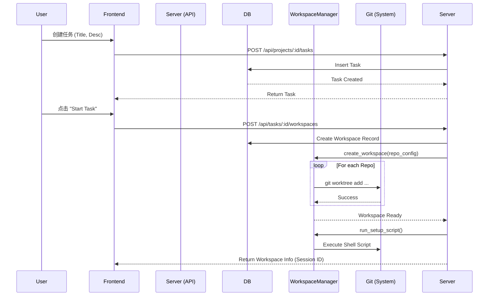
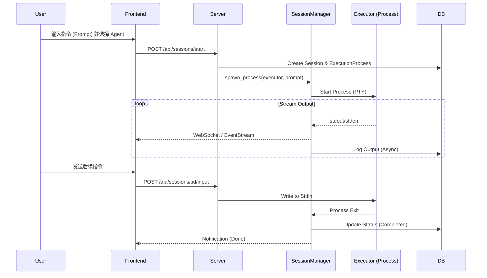
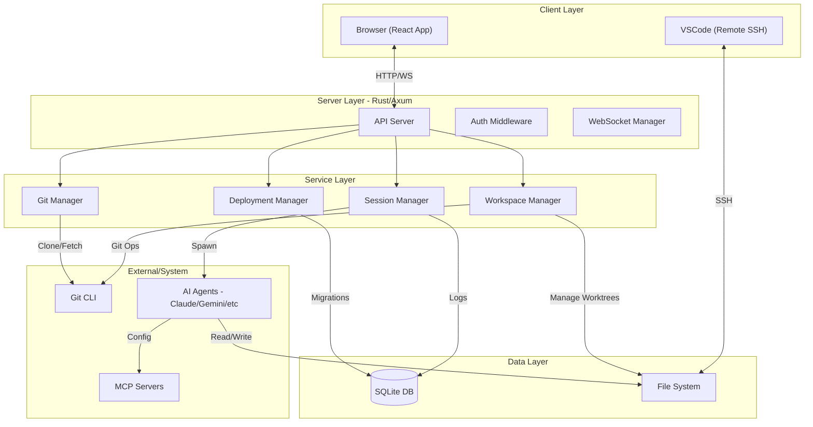

# Vibe Kanban 业务代码仓库文档

## 1. 业务场景

**Vibe Kanban** 是一个专为 AI 编程代理（AI Coding Agents）设计的任务编排与协作平台。它的核心目标是帮助开发者更高效地管理、编排和审查 AI 代理（如 Claude Code, Gemini CLI, OpenAI Codex 等）所完成的编码任务。

在传统的 AI 辅助编程中，开发者往往需要手动管理上下文、切换分支、运行命令，并不直观地了解 AI 的执行进度。Vibe Kanban 提供了一个 Kanban（看板）式的界面，将软件开发流程中的“任务（Task）”作为核心单元，围绕任务进行环境隔离、代理执行、代码审查和合并。

主要解决的问题包括：
*   **多代理协作**：支持并在同一个任务中切换使用不同的 AI 代理。
*   **环境隔离**：为每个任务自动创建独立的 Git Worktree，确保 AI 的修改不会污染主分支或其他进行中的任务。
*   **可视化编排**：通过看板视图直观展示任务状态（待办、进行中、审查中、已完成）。
*   **远程开发支持**：支持通过 SSH 连接远程服务器上的 Vibe Kanban 实例进行开发。

## 2. 关键概念

在 Vibe Kanban 的技术实现中，以下概念构成了业务逻辑的核心：

*   **Project (项目)**
    *   顶层容器，通常对应一个具体的软件工程项目。
    *   关联一个或多个 **Repository (仓库)**，支持多仓库（Monorepo 或 Polyrepo）结构。
    *   包含项目级别的配置，如 setup/cleanup 脚本。

*   **Task (任务)**
    *   最小的工作单元，代表一个具体的开发需求（如“修复 Bug X”、“添加功能 Y”）。
    *   在看板上流转，状态包括：`todo` (待办), `inprogress` (进行中), `inreview` (审查中), `done` (完成), `cancelled` (取消)。
    *   一个任务可以包含子任务。

*   **Workspace (工作空间)** (曾用名: Task Attempt)
    *   任务的物理执行环境。
    *   **核心实现**：基于 Git Worktree 技术。当用户开始一个任务时，系统会在文件系统中为该任务创建一个隔离的目录，并检出相关的 Git 分支。
    *   保证了不同任务之间的文件修改互不干扰。

*   **Session (会话)**
    *   在 Workspace 中与特定 AI 代理的一次交互过程。
    *   一个 Workspace 可以包含多个 Session（例如，先用 Claude 写代码，再用 Gemini 修复 Bug）。
    *   记录了当前使用的 **Executor (执行器)** 类型。

*   **Executor (执行器/代理)**
    *   对 AI Coding Agent 的抽象封装。
    *   例如：`claude-code`, `gemini-cli`, `cursor-agent` 等。
    *   负责接收 Prompt，执行命令，修改代码，并返回结果。

*   **Execution Process (执行进程)**
    *   Session 下的具体运行单元。
    *   类型包括：
        *   `codingagent`: 运行 AI 代理进行编码。
        *   `setupscript`: 运行环境初始化脚本。
        *   `devserver`: 运行开发服务器。
        *   `cleanupscript`: 运行清理脚本。
    *   记录了进程的 stdout/stderr、状态和退出码。

*   **Coding Agent Turn (代理轮次)**
    *   记录 AI 代理执行过程中的每一次交互（Prompt 和 Summary）。

## 3. 关键业务流程

### 3.1 任务创建与工作空间初始化
1.  用户在看板创建 **Task**。
2.  用户点击“开始任务”，系统创建 **Workspace**。
3.  **WorkspaceManager** 根据项目配置，在文件系统中创建目录，并为关联的 Git 仓库创建 **Worktree**。
4.  自动检出新分支（通常基于主分支）。
5.  运行项目的 `setup_script` 进行依赖安装或环境配置。

### 3.2 代理执行循环 (Agent Execution Loop)
1.  用户在 Workspace 中选择一个 **Executor** (如 Claude Code) 并输入 Prompt。
2.  系统创建一个 **Session** 和对应的 **Execution Process**。
3.  后端通过 PTY (伪终端) 启动代理进程，将用户输入传递给代理，并实时捕获代理的输出（Log/Diff）。
4.  代理在 Workspace 的隔离环境中修改代码、运行测试。
5.  用户可以实时查看日志、文件变更（Diff）。

### 3.3 代码审查与合并
1.  任务完成后，用户将状态拖至 `inreview`。
2.  系统可以生成 Pull Request (PR) 或直接进行合并操作。
3.  **Merges** 表记录了合并请求的状态和关联的 Commit 信息。
4.  任务完成后，触发清理逻辑，删除 Worktree，释放磁盘空间。

## 4. 接口逻辑时序图

### 4.1 创建任务并启动工作空间 (Create Task & Start Workspace)

### 4.2 运行 AI 代理会话 (Run Agent Session)

## 5. 系统架构图

